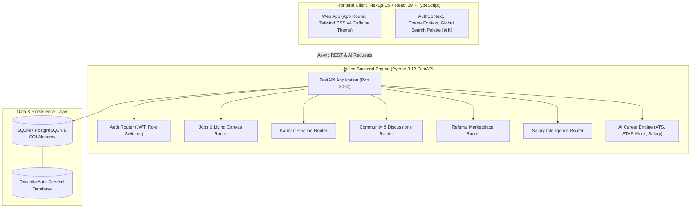

# ☕ JobSift — The Unified One-Stop Career Operating System

> **Rethinking the modern job search:** Bringing together job discovery, insider culture debriefs, verified referral matchmaking, an interactive application Kanban pipeline, and an AI Career Copilot into a unified ecosystem built with **Next.js 15 (TypeScript, Tailwind CSS v4)** and a high-performance **Python FastAPI** backend.

---

## 🌟 Executive Summary & Problem Breakdown

### The Status Quo Problem: Extreme Fragmentation
In today's hyper-competitive job market, candidates and professionals face severe platform fatigue and fragmented workflows:
1. **Discovery:** Browsing generic job boards (Indeed, LinkedIn) with zero context on actual work conditions.
2. **Insider Truth:** Digging through Reddit (`r/cscareerquestions`), Blind, or Discord for unfiltered interview debriefs and real team culture.
3. **Compensation Data:** Searching Glassdoor or Levels.fyi for pay benchmarks and negotiation ranges.
4. **Networking & Referrals:** Cold messaging employees on LinkedIn with `<5%` response rates.
5. **Tracking:** Maintaining separate Notion boards or Google Sheets to track application pipelines.
6. **Preparation:** Copy-pasting resumes into ChatGPT for generic bullet rewrites.

### The JobSift Solution: A Unified Career OS
JobSift unifies these disconnected tools into an **interconnected context graph** styled with a warm **Caffeine Design System**:
- When viewing a job opening, you don't just see a static description—you immediately see **linked insider interview debriefs**, **verified employee referrers**, **real-time AI skill-gap radar**, and a **1-click tailored AI mock interview launcher**.
- Verified employees offer referrals with transparent monthly quotas and anti-spam karma escrows.
- Candidates track applications seamlessly through a visual **Kanban pipeline** with real-time status updates and salary offer comparison tools.

---

## 🚀 Key Innovations & Core Features

```
                   ┌───────────────────────────────────────────────┐
                   │           JOBSIFT LIVING CANVAS               │
                   ├───────────────────────────────────────────────┤
                   │  1. Unified Job Specifications & Tech Stack   │
                   │  2. AI Match Radar & ATS Keyword Gap Analysis │
                   │  3. Real Verified Company Insider Debriefs    │
                   │  4. Available Verified Referrers & 1-Click DM │
                   │  5. Interactive AI STAR Mock Interviewer      │
                   └───────────────────────────────────────────────┘
```

### 1. 📋 The Living Job Canvas
* **Unified Intelligence:** Combines job requirements, compensation ranges, verified company culture scorecards, and employee feedback in one screen.
* **AI Skill-Gap Radar:** Compares the candidate's profile against the role's tech stack in real-time, displaying a 0–100% match fit, matched skills, and high-value keywords to incorporate.

### 2. 🤝 Verified Referral Marketplace
* **Direct Matchmaking:** Verified employees at Google, Stripe, Figma, and OpenAI offer referrals with transparent quotas and track records.
* **Structured Pitches:** Candidates submit personalized pitches with auto-attached verified match scores and portfolio links, eliminating recruiter cold-inbox spam.
* **Karma & Reputation Engine:** Users earn Karma points for providing helpful interview advice and submitting candidate referrals.

### 3. 💬 Community Insider Discussions & Salary Truth
* **Threaded Channels:** `#interview-prep`, `#salary-talk`, `#resume-review`, `#referrals`, `#company-culture`.
* **Anonymous Posting Toggle:** Enables employees and candidates to discuss sensitive compensation numbers and interview experiences without risking professional privacy.
* **Solution Verification:** Top-rated debriefs are marked as "Verified Solutions".

### 4. 📊 End-to-End Application Kanban Pipeline
* **Visual Status Columns:** `Bookmarked` → `Applied` → `Recruiter Screen` → `Tech / Onsite` → `Offer Extended 🎉` → `Archived`.
* **Actionable Tracking:** Notes editor, interview date countdowns, salary offer comparator, and 1-click stage advancement.

### 5. 🤖 AI Career Copilot & Studio (Python FastAPI Engine)
* **ATS Resume Scanner:** Evaluates resume text vs. target JD across Skills Match, Impact Metrics (quantified KPIs), Action Verbs, and Brevity with before/after bullet rewrites.
* **Interactive AI Mock Interview Studio:** Dynamic practice interview tailored to any role (Behavioral STAR, Distributed System Design, Problem Solving) with live feedback scoring rubrics and staff-level exemplar answers.
* **Salary Benchmark & Counter-Offer Copilot:** Real-time compensation percentiles (25th, Median, 75th, 90th) paired with custom battle-tested negotiation scripts.
* **Tailored Cover Letter & Cold DM Generator:** Generates role-specific outreach messages and cover letters.

### 6. 💼 Recruiter & Employer Command Center
* **Job Creation with AI JD Generator:** Instantly crafts rich job descriptions and automatically extracts technical skill tags.
* **AI-Ranked Applicant Pipeline:** Sorts candidates by AI skill match score and provides 1-click status transitions.

---

## 🏛️ System Architecture & Design Principles



### Key System Design Highlights:
1. **Unified Python FastAPI Backend (`backend/`):** High-throughput asynchronous Python engine handling heavy semantic parsing, regex skill extraction, JWT authentication, and relational CRUD operations.
2. **Next.js Client (`frontend/`):** Server-rendered layouts with client-side interactive islands, optimized bundles, and responsive fluid layouts.
3. **Decoupled Fallback Strategy (Zero-Downtime UI):** The frontend contains a client-side mock mirror of the data schema, guaranteeing smooth evaluation even before the backend spins up.
4. **Database Normalization & Indexing:** Foreign-key relationships with cascading deletes across Users, Jobs, Applications, Posts, Comments, and Referrals.
5. **Security & RBAC:** JWT Bearer authentication with SHA-256 password salting and role-based access control (Candidate, Recruiter, Employee).

---

## 🎨 Caffeine Design System

JobSift features the custom **Caffeine Theme** (`@import "tailwindcss";` and `@theme inline`):
* **Warm Coffee Tones:** `--primary: #644a40` (Dark Roast Brown), `--secondary: #ffdfb5` (Warm Foam Latte), `--background: #f9f9f9` / Dark Mode `--background: #111111`.
* **Responsive Layout:** Optimized for Mobile Drawer & Bottom Dock (<768px), Tablet Grid, and Laptop/4K Desktop multi-pane layouts.
* **Glassmorphism & Micro-animations:** Subtle backdrops, interactive hover states, and celebratory confetti effects.

---

## 🔑 Test Credentials & Demo Personas (1-Click Fast Switch)

JobSift includes a top **Evaluator Fast-Switch Banner** to test different user personas instantly without logging in and out:

| Persona | Role | Email | Password | What to Test |
| :--- | :--- | :--- | :--- | :--- |
| **Alex Rivera** | `Candidate` | `alex.rivera@example.com` | `password123` | Apply to jobs, test AI ATS Scanner, run AI Mock Interview, manage Kanban tracker |
| **Sarah Chen** | `Recruiter` | `sarah.chen@stripe.com` | `password123` | Post new jobs with AI JD generator, review AI-ranked candidate pipeline |
| **David Kim** | `Employee / Referrer` | `david.kim@google.com` | `password123` | Offer referrals at Google, review incoming candidate pitches & approve referrals |

---

## 🔐 Environment Variables Configuration

JobSift works out-of-the-box with built-in fallbacks, but you can configure environment variables for custom databases, live AI generation via Mistral, and custom ports.

### 🐍 Backend (`backend/.env`)

Copy `backend/.env.example` to `backend/.env`:

```bash
cd backend
cp .env.example .env     # On Linux/macOS
# copy .env.example .env # On Windows CMD
```

| Variable | Type | Default | Description |
| :--- | :--- | :--- | :--- |
| `DATABASE_URL` | String | `sqlite:///./jobsift.db` | Full database URI (SQLite or PostgreSQL / Neon). |
| `PGHOST` | String | _(Optional)_ | PostgreSQL host address (e.g. Neon host). |
| `PGDATABASE` | String | `neondb` | PostgreSQL database name. |
| `PGUSER` | String | _(Optional)_ | PostgreSQL username. |
| `PGPASSWORD` | String | _(Optional)_ | PostgreSQL password. |
| `PGPORT` | Integer | `5432` | PostgreSQL port. |
| `PGSSLMODE` | String | `require` | SSL mode (`require` or `disable`). |
| `SECRET_KEY` | String | `jobsift-super-secret-...` | Secret key used to sign and verify JWT authentication tokens. |
| `ALGORITHM` | String | `HS256` | JWT encryption algorithm. |
| `ACCESS_TOKEN_EXPIRE_MINUTES` | Integer | `10080` | JWT token lifespan in minutes (default 7 days). |
| `MISTRAL_API_KEY` | String | `""` | *(Optional)* Mistral AI API key for dynamic resume scoring & live mock interviews. If blank, built-in offline heuristics are used. |
| `MISTRAL_MODEL` | String | `mistral-small-latest` | Mistral model identifier. |
| `BACKEND_CORS_ORIGINS` | JSON Array | `["http://localhost:3000", ...]` | Allowed CORS origins for frontend requests. |

---

### ⚛️ Frontend (`frontend/.env.local`)

Copy `frontend/.env.example` to `frontend/.env.local`:

```bash
cd frontend
cp .env.example .env.local     # On Linux/macOS
# copy .env.example .env.local # On Windows CMD
```

| Variable | Type | Default | Description |
| :--- | :--- | :--- | :--- |
| `NEXT_PUBLIC_API_URL` | String | `http://localhost:8000/api` | Base URL of the FastAPI backend API. |

---

## ⚡ Quick Start Guide (Run Locally)

### Prerequisites
* **Node.js:** v18+ (v20+ recommended)
* **Python:** v3.10+ (v3.12 recommended)
* **npm / pip**

### Option A: One-Command Startup (Windows PowerShell)
```powershell
# In the project root directory
.\start.ps1
```
*(Or on Windows CMD: `start.bat`)*

This concurrently starts:
1. **Python FastAPI Backend** on `http://localhost:8000` (Swagger docs: [`http://localhost:8000/docs`](http://localhost:8000/docs))
2. **Next.js Frontend** on [`http://localhost:3000`](http://localhost:3000)

---

### Option B: Manual Step-by-Step Startup

#### 1. Start Python FastAPI Backend
```bash
cd backend
# Activate virtual environment
.\venv\Scripts\activate      # On Windows
# source venv/bin/activate    # On Linux/macOS

# Run FastAPI server
uvicorn app.main:app --host 0.0.0.0 --port 8000 --reload
```
*The database (`neondb` / `jobsift.db`) will automatically initialize and seed with realistic sample jobs, users, community posts, referrals, and salary benchmarks on first launch!*

#### 2. Start Next.js Frontend
```bash
cd frontend
npm run dev
```
Open **`http://localhost:3000`** in your browser.

---

## 📡 API Reference Overview

| Endpoint | Method | Description |
| :--- | :--- | :--- |
| `/api/auth/register` | `POST` | Create a new candidate, recruiter, or employee account |
| `/api/auth/login` | `POST` | Authenticate with email/password and obtain JWT |
| `/api/auth/switch-demo-persona` | `POST` | Instant 1-click evaluator persona switcher |
| `/api/jobs` | `GET` | Search and filter job opportunities (remote, salary, stack) |
| `/api/jobs/{id}/insider-intelligence` | `GET` | **Living Job Canvas:** fetches linked discussions & referrers |
| `/api/applications/my-pipeline` | `GET` | Retrieve user's personal Kanban pipeline |
| `/api/applications/apply` | `POST` | Submit 1-click application with resume & notes |
| `/api/community/posts` | `GET` | Feed with channel and company filters |
| `/api/community/posts/{id}/comments`| `GET/POST`| Nested threaded discussions and replies |
| `/api/referrals/listings` | `GET/POST`| Browse or post verified employee referral opportunities |
| `/api/referrals/requests` | `POST` | Submit personalized referral pitch to employee |
| `/api/ai/analyze-resume` | `POST` | AI ATS match scoring, missing skills, bullet rewrites |
| `/api/ai/mock-interview/start` | `POST` | Start dynamic role-specific mock interview session |
| `/api/ai/mock-interview/submit-answer`| `POST` | Real-time STAR rubric answer evaluation & exemplar |
| `/api/ai/salary-benchmark` | `POST` | Total comp percentiles & negotiation counter script |
| `/api/salaries` | `GET` | Verified community salary database & statistics |

---

## 🏆 Project Completeness Checklist

- [x] **Discovering & Searching for Jobs** (Multi-filter search, salary filters, tech stack tags)
- [x] **Applying for Jobs** (1-Click apply, AI cover letter generator, confetti feedback)
- [x] **Professional Profile Studio** (Skills proficiency, master resume, portfolio links, karma tracker)
- [x] **Posting Job Opportunities** (Recruiter portal with AI JD generator & applicant ranking)
- [x] **Community Q&A & Debriefs** (Threaded Reddit/Discord style channels, anonymous posting, upvotes)
- [x] **Verified Referral Marketplace** (Employee listings, structured pitches, karma rewards)
- [x] **End-to-End Kanban Tracker** (Stage advancement, notes editor, interview dates)
- [x] **AI Career Copilot Suite** (ATS Scanner, Live STAR Mock Interviewer, Salary Negotiator)
- [x] **System Design Principles** (FastAPI async backend, Next.js 15, SQLAlchemy DB schema)
- [x] **Fully Responsive Caffeine UI** (Mobile bottom dock & drawer, tablet grid, desktop multi-pane)
- [x] **Evaluator Fast Switcher** (1-Click persona switcher for instant grading)
